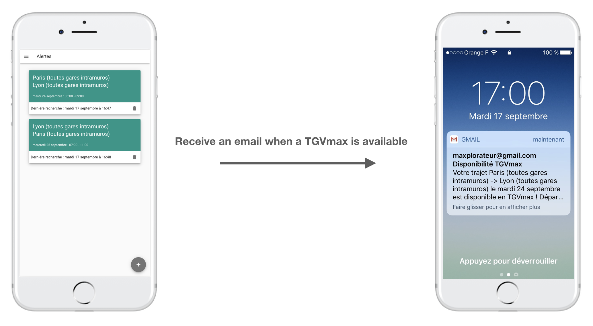

## Get the best from your TGVmax subscription
*If you’re 16-27 years old and travel at least twice a month with TGV and Intercités, TGVmax is for you. For just €79 per month, you can travel as often as you like.*  

The official definition above used to be true, it was awesome. However it becomes harder and harder to find a TGVmax seat available, especially for people who want to travel friday or sunday evening.

The process of booking a TGVmax seat now looks like that : 
- Connect to oui.sncf at midnight exactly 30 days before the date you want to travel 🕛  
- If you're lucky, there is a seat available : book it immediatly and you're done ✅  
- Otherwise, a seat may become available at random time during the next 30 days. So you need to connect as often as you can to oui.sncf and hope to find an available seat.

This process is boring and time consuming. This project is an attempt to make it fully automatic by creating TGVmax alerts.

## Understand how it works
Please read documentation [here](./doc/sncf.md)

## How to use this project locally ?

### Prerequisites
1/ Install [MongoDB](https://www.mongodb.com/download-center/community)

2/ Install [Docker and Docker Compose](https://docs.docker.com/docker-for-mac/install/)

### Run the app locally
1/ Open a terminal and start your local mongodb server
```bash
mongodb
```

2/ Open another terminal and go in the project directory (/TGVmax).

3/ Build both docker containers
```bash
docker-compose -f docker-compose.dev.yml build
```

4/ Run both docker compose services and wait a moment
```bash
docker-compose -f docker-compose.dev.yml up
```

5/ Open your web browser and go to `http://localhost:8080/`. You should see the app running.

6/ Create an account. If everything worked well, you should see a new document in your local mongodb database, in the collection *users* 😊.